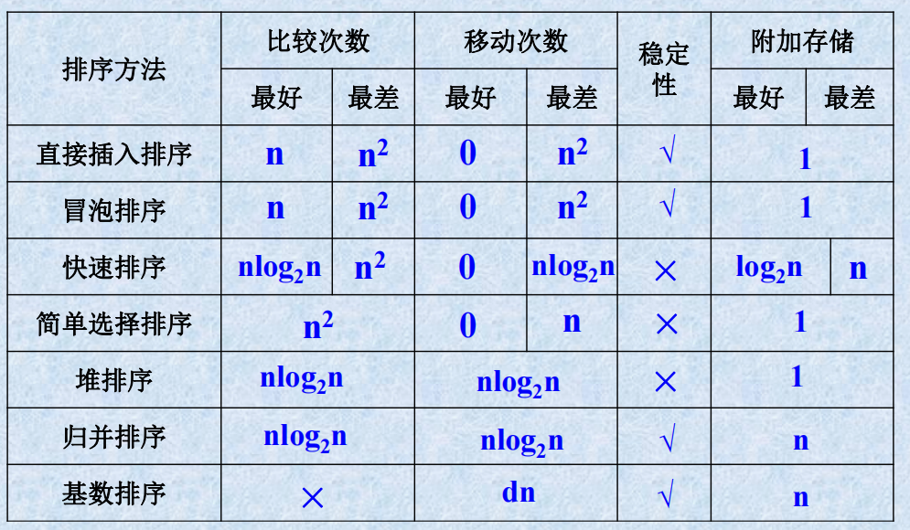

# 直接插入算法

**最好情况的比较次数就是从第二个元素开始往后，每一个元素都与他之前的元素比，恰巧都满足条件，所以只有`n-1`次，移动次数就是`0`；**
**最差情况的比较次数就是从第二个元素开始往后，每一个元素都是比它之前的元素小，那么就要将此元素保存在监视哨，前面的元素后移，最坏则前面的元素都后移，`i-1`个，然后再将监视哨的放到最前面，共`i+1`次移动次数，比较次数就是前面的每个元素都与监视哨的元素比较，注意这里到最头上还有监视哨与他本身进行比较，所以共`i-1+1 = i`次**

](image.png)
折半插入排序算法的时间复杂度主要由两部分组成：比较次数和移动次数。以下是对折半插入排序的时间复杂度进行详细的计算：

## 比较次数的计算

1. **外层循环：**
   - 外层循环执行 \(n-1\) 次，其中 \(n\) 是序列的长度。

2. **内层循环：**
   - 内层循环是一个折半查找，每次折半查找的比较次数可以用 \(O(\log_2 i)\) 表示，其中 \(i\) 是当前待插入元素的位置。

3. **总比较次数：**
   - 在最坏情况下（逆序序列），对于每个 \(i\)，比较次数为 \(O(\log_2 i)\)。
   - 所以总的比较次数为 \(\sum_{i=2}^{n} O(\log_2 i)\)。

## 移动次数的计算

1. **元素移动：**
   - 在最坏情况下，每次都需要将大约 \(O(i)\) 个元素后移。
   - 所以总的移动次数为 \(\sum_{i=2}^{n} O(i)\)。

## 时间复杂度计算

在计算时间复杂度时，我们通常考虑增长最快的项，因此：

1. 对于比较次数，可以近似为 \(\sum_{i=2}^{n} O(\log_2 i) = O(\log_2 n!)\)。
2. 对于移动次数，可以近似为 \(\sum_{i=2}^{n} O(i) = O(n^2)\)。

综合考虑，折半插入排序的时间复杂度为主要由比较次数主导，因此它的时间复杂度为 \(O(\log_2 n!)\) 或者更精确地说是 \(O(n \log_2 n)\)。在实践中，折半插入排序的性能通常优于直接插入排序，尤其是在对大规模数据排序时。

](image2.png)

](image3.png)

**3倍的移动次数是因为Swap函数使用的临时变量的原因**

分析无敌：
> <https://www.cnblogs.com/tuyang1129/p/12857821.html>

快速排序在最坏情况下会退化为 \(O(n^2)\) 的时间复杂度，主要是由于选择的基准元素导致的划分不均匀。最典型的情况是每次选择的基准元素都是当前子数组中的最大或最小元素。
**快速排序就是一种不稳定的排序算法，因为在分区过程中，相等元素的相对顺序可能发生变化。**
这种情况发生的典型场景包括：

1. **已排序或逆序的数组：** 如果输入数组已经是有序或逆序的状态，而每次选择的基准元素都是当前子数组中的最大或最小元素，导致划分非常不均匀。这样的情况下，递归树呈现链状结构，每次划分只能减少一个元素，导致快速排序的性能退化为 \(O(n^2)\)。

2. **所有元素值相同的数组：** 如果数组中的所有元素值都相同，无论选择哪个元素作为基准，划分都是不均匀的。这时每次划分只能将数组分成一个元素和其余的元素，同样导致退化。

3. **特定实现中的枢轴选择问题：** 在某些实现中，如果基准元素的选择策略不当，也可能导致划分不均匀，进而导致性能的退化。

为了减少这种情况的发生，通常可以采用一些优化措施，比如随机选择基准元素、三数取中法（选择左端、右端和中间位置的三个元素的中值作为基准），以及对于小规模的子数组采用其他排序算法等。这些策略能够提高快速排序在各种情况下的性能表现。

**堆排序的每次调整相当于把最大的元素拿到堆顶，然后再放到外部，总共有n个元素要放，每次获取内部的最大元素的时候要查询的次数就是这个堆的深度 \(\log n\)**
堆排序分析无敌：
><https://www.cnblogs.com/chengxiao/p/6129630.html>

每次调整堆顶的过程需要进行 \( \log n \) 次关键字比较的原因与堆的性质以及堆排序的特点有关。

在堆中，堆顶元素是整个堆中最大（或最小）的元素。调整堆顶的过程通常是为了将堆顶元素移动到已排序的部分，并将堆中剩余部分重新调整成一个堆。

堆的性质决定了在调整的过程中，每次需要比较当前节点与其子节点的键值。考虑最大堆的情况，每次调整时，父节点需要与其左右子节点进行比较，找到最大的子节点，然后与之交换位置。这个过程是一个自顶向下的比较和交换的过程。

假设堆的深度为 \( \log n \)，即堆的高度为 \( \log n \)。在每一层上，都需要进行一次比较，因为每一层都需要确定当前节点与其左右子节点中的较大值（或较小值）。

因此，在整个调整堆顶的过程中，最多需要进行 \( \log n \) 次比较，因为堆的高度是 \( \log n \)。这也是为什么说每次调整堆顶的过程需要进行 \( \log n \) 次关键字比较的原因。这种自顶向下的比较和交换的方式保证了调整的效率，使得堆排序的时间复杂度为 \( O(n \log n) \)。

><https://blog.csdn.net/qq_43628835/article/details/121894423?spm=1001.2101.3001.6650.1&utm_medium=distribute.pc_relevant.none-task-blog-2%7Edefault%7EBlogCommendFromBaidu%7ERate-1-121894423-blog-133251725.235%5Ev38%5Epc_relevant_sort&depth_1-utm_source=distribute.pc_relevant.none-task-blog-2%7Edefault%7EBlogCommendFromBaidu%7ERate-1-121894423-blog-133251725.235%5Ev38%5Epc_relevant_sort&utm_relevant_index=2>

**rd是关键字的个数**

><https://zhulinyin.github.io/2019/01/27/%E6%8E%92%E5%BA%8F%E7%AE%97%E6%B3%95%E6%80%BB%E7%BB%93/>

|排序算法| 时间复杂度（平均）| 时间复杂度（最坏）| 时间复杂度（最好）| 空间复杂度| 稳定性|
|------|------------------|---------------|----|----|---|
|插入排序 |\(O(n^2)\) |\(O(n^2)\) |\(O(n)\)| \(O(1)\)| 稳定|
|希尔排序 |\(O(n^{1.3})\) |\(O(n^2)\) |\(O(n)\) |\(O(1)\) |不稳定|
|选择排序| \(O(n^2)\) |\(O(n^2)\)| \(O(n^2)\) |\(O(1)\) |不稳定|
|堆排序 |\(O(nlog_{2} n)\)| \(O(nlog_{2}n)\) |\(O(nlog_{2}n)\) |\(O(1)\) |不稳定|
|冒泡排序 |\(O(n^2)\)| \(O(n^2)\) |\(O(n)\) |\(O(1)\) |稳定|
|快速排序 |\(O(nln_{} n)\)| \(O(n^2)\)| \(O(nlog_{2}n)\)| \(O(log_{2}n) or O(n)\)  |不稳定|
|归并排序| \(O(nlog_{2}n)\) |\(O(nlog_{2}n)\) |\(O(nlog_{2}n)\)| \(O(n)\) |稳定|
|基数排序| \(O(nlog(r)m)\)| \(O(nlog(r)m)\)| \(O(nlog(r)m)\)| \(O(n+m)\)| 稳定|
