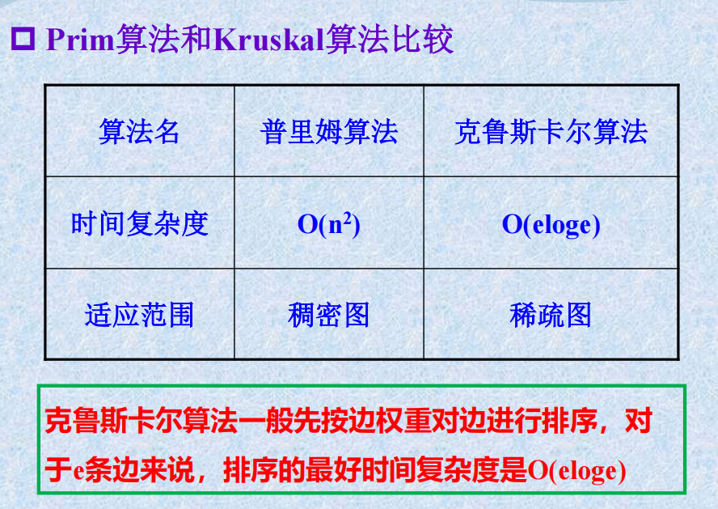

Dijkstra算法和Floyd算法对于负权边的处理方式不同，这导致了它们在处理负权边时的限制。

### Dijkstra算法：

Dijkstra算法是一种单源最短路径算法，它通过贪心的策略，每次选择当前最短路径的顶点进行松弛操作。Dijkstra算法的前提是图中的边权都为非负数。这是因为如果存在负权边，那么在每次选择最短路径的时候，可能会出现选择负权边的情况，导致最终得到的结果不是最短路径。

### Floyd算法：

Floyd算法是一种多源最短路径算法，它通过逐步迭代更新所有节点对之间的最短路径。Floyd算法对边的权值没有特殊的要求，可以处理负权边，但是不能处理含有负权回路的图。

如果存在负权回路，意味着可以通过循环遍历这个回路来无限地减小路径长度，导致最短路径无法得到有限的值。Floyd算法的更新规则是基于节点之间的比较，而负权回路可能导致无限循环的更新，因此Floyd算法无法处理含有负权回路的图。

综上所述，Dijkstra算法不能处理带有负权边的图，而Floyd算法可以处理带有负权边的图，但不能处理带有负权回路的图。在实际应用中，选择算法需要根据图的特性来决定，以满足具体问题的需求。
