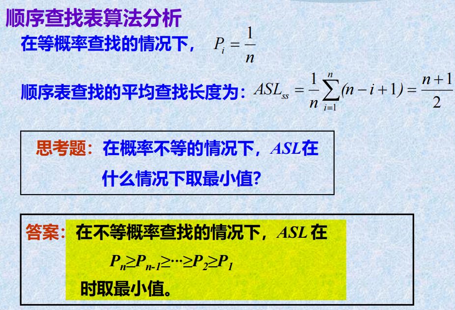
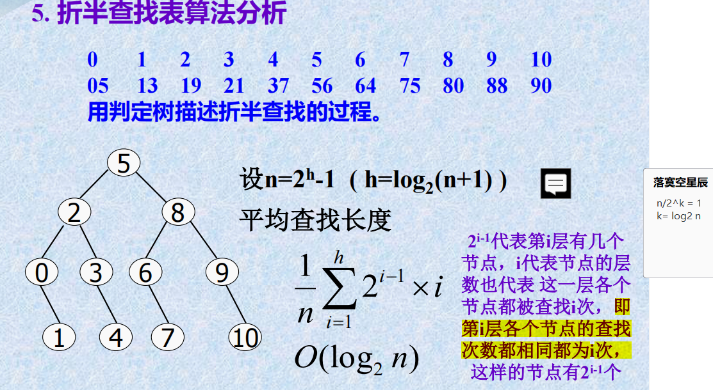
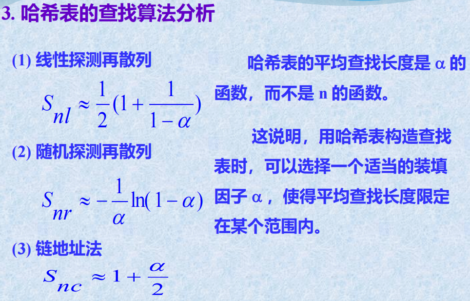

# 查找知识点整理

散列查找（Hashing）和其他查找方法之间有一些关键的区别，主要涉及到查找键值的存储和检索方式。以下是散列查找与其他常见查找方法的比较：

1. **散列查找（Hashing）：**
   - **原理：** 利用散列函数将关键字映射到数组的特定位置（槽位）上，直接在该位置进行查找。
   - **优点：** 在平均情况下，散列查找具有较快的查找速度，不受数据规模影响。
   - **缺点：** 可能发生散列冲突，即不同的关键字映射到相同的槽位上，需要解决冲突的方法。

2. **顺序查找（Sequential Search）：**
   - **原理：** 从数据集的开头开始逐一查找，直到找到目标元素或遍历完整个数据集。
   - **优点：** 适用于无序数据集，不需要预先排序。
   - **缺点：** 查找速度相对较慢，时间复杂度为 O(n)。

3. **二分查找（Binary Search）：**
   - **原理：** 基于有序数据集，通过递归或迭代方式将查找范围逐渐缩小为一半，直到找到目标元素。
   - **优点：** 查找速度较快，时间复杂度为 O(log n)。
   - **缺点：** 仅适用于有序数据集。

4. **二叉搜索树查找（Binary Search Tree）：**
   - **原理：** 基于二叉搜索树的结构，通过比较关键字大小决定搜索方向，递归或迭代查找目标元素。
   - **优点：** 在树保持平衡的情况下，平均查找速度为 O(log n)。
   - **缺点：** 如果二叉搜索树不平衡，可能退化为链表，导致查找速度降为 O(n)。

5. **线性查找（Linear Search）：**
   - **原理：** 类似于顺序查找，从数据集的开头开始逐一查找，直到找到目标元素或遍历完整个数据集。
   - **优点：** 适用于无序数据集，不需要预先排序。
   - **缺点：** 查找速度相对较慢，时间复杂度为 O(n)。

总体而言，散列查找适用于大规模数据集，具有较快的平均查找速度，但需要处理散列冲突。其他查找方法的适用场景取决于数据集的有序性和特点。例如，二分查找适用于有序数据集，而顺序查找和线性查找适用于无序数据集。
